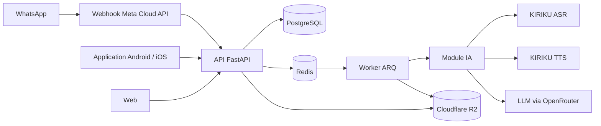

# Leeral

**Leeral explique à voix haute, en wolof et en pulaar, les documents écrits en français.** Ordonnances, factures, courriers, convocations : on photographie le document dans l'application, ou on l'envoie sur WhatsApp, et Leeral en dit l'essentiel dans sa langue. On pose ensuite ses questions en vocal.

Projet de l'équipe **New Wave** pour le **Kiriku Voice Inclusive & Creative Challenge** (AI Hub Sénégal, 2026).

## Le problème

Au Sénégal, l'administration, la santé, les banques et les entreprises écrivent en français. Une grande partie de la population parle le wolof, le pulaar ou le sérère au quotidien, mais lit difficilement le français. Pour comprendre une facture, une ordonnance ou une convocation, il faut demander à quelqu'un, attendre, et parfois partager des informations privées.

Leeral rend ces documents compréhensibles **sans savoir lire**, seul et tout de suite, sur le téléphone qu'on a déjà.

## Essayer Leeral

| Canal | Accès |
|---|---|
| **WhatsApp** | Écrire « Salam » au **+221 76 611 10 21** ([ouvrir la discussion](https://wa.me/221766111021)) |
| **Application Android** | [Installer l'APK](https://expo.dev/accounts/bach_johnson/projects/leeral/builds/578f2236-5fa4-49b4-993e-37789ed84705) |
| **Web (iPhone, ordinateur)** | [leeral.expo.app](https://leeral.expo.app), puis « Sur l'écran d'accueil » dans Safari |

Le mode invité permet de tout essayer sans créer de compte. Le code de connexion de démonstration est donné dans le dossier de soumission.

## Ce que fait Leeral

- **Explication vocale d'un document** : photo d'une ou plusieurs pages, PDF ou DOCX. Leeral contrôle la netteté de la photo, lit le document, puis donne un résumé et les points importants (montants, dates, démarches) à l'écrit et à l'oral, en wolof ou en pulaar.
- **Questions à voix haute** : « Kañ laa wara fey ? » Leeral répond à partir du document, sans inventer de chiffre.
- **Ordonnances, avec prudence** : double lecture, vérification de chaque médicament avec un lexique et des règles de posologie. Une ligne douteuse renvoie vers le pharmacien au lieu de donner une dose.
- **« Écrire pour moi »** : Leeral pose les questions à l'oral et rédige un CV ou une lettre en français, prêt à partager en PDF.
- **« Apprendre le français »** : des exercices courts à partir des mots des documents de l'utilisateur.
- **Leeral+** : abonnement à 500 F CFA par mois (paiement simulé dans le prototype).
- **Interface pensée pour ne pas lire** : chaque écran et chaque bouton a sa consigne vocale dans la langue choisie.

## Langues

| Langue | Explication et voix | Questions vocales |
|---|---|---|
| Wolof | ✅ | ✅ |
| Pulaar | ✅ | ✅ |
| Sérère | prévu | prévu |

## Architecture



Tout le raisonnement se fait en français. La traduction et la voix viennent à la fin : le texte est traduit en wolof ou en pulaar, puis lu par la voix KIRIKU. Les noms de médicaments et tous les nombres sont protégés pendant la traduction, pour qu'aucun chiffre ne soit déformé.

| Dossier | Contenu |
|---|---|
| [`api/`](api/README.md) | API FastAPI, worker ARQ, intégration WhatsApp et module IA ([détails du module IA](api/docs/AI_MODULE.md)) |
| [`mobile/`](mobile/README.md) | Application Expo (React Native) pour Android, iOS et le web |

## Lancer le projet

Toute la configuration passe par un seul fichier `.env` à la racine, jamais versionné :

```powershell
copy .env.example .env
```

Sans aucune clé, le projet tourne avec un moteur IA simulé : `AI_PROVIDER=mock`, `STORAGE_BACKEND=local`, `OTP_DELIVERY=console`.

- API et worker : voir [`api/README.md`](api/README.md).
- Application : voir [`mobile/README.md`](mobile/README.md).

## Données et éthique

- Les documents sont privés : stockage chiffré sur R2, accès par des liens signés qui expirent.
- Les documents des invités sont supprimés automatiquement, ainsi que les comptes invités inactifs.
- Aucun contenu de document, aucune transcription et aucun numéro de téléphone complet n'apparaissent dans les journaux.
- Les ordonnances réelles utilisées pour évaluer le module IA ne sont pas dans ce dépôt.
- Leeral explique un document : il ne remplace ni le médecin, ni le pharmacien, ni l'administration.

## Limites connues

- L'analyse d'un document prend environ une minute.
- La reconnaissance vocale peut se tromper sur les noms propres et les accents marqués.
- La traduction de certains termes administratifs ou médicaux peut rester approximative.
- Le sérère n'est pas encore disponible.
- Le paiement Leeral+ est simulé.

## Sources et licences

| Ressource | Usage |
|---|---|
| [KIRIKU ASR et TTS](https://huggingface.co/AIHubSN), AI Hub Sénégal | Reconnaissance et synthèse vocales en wolof et en pulaar |
| [OpenRouter](https://openrouter.ai) | Accès aux modèles de lecture, d'analyse et de traduction (modèles configurables dans `.env.example`) |
| Meta WhatsApp Cloud API | Canal WhatsApp |
| FastAPI, SQLAlchemy, Alembic, ARQ, Pydantic | API et tâches de fond |
| Expo, React Native, Expo Router | Application mobile et web |

Le code de Leeral est publié sous [licence MIT](LICENSE). Les modèles et services cités restent soumis à leurs propres conditions d'utilisation.

## Équipe New Wave

| Membre | Rôle |
|---|---|
| **Mamadou Bachir Sy** | Produit, design, développement de l'API, de WhatsApp et de l'application, déploiement |
| **Ahmadou Ndiaye** | Module IA : lecture des documents, prompts, traduction, qualité des réponses en wolof et en pulaar |